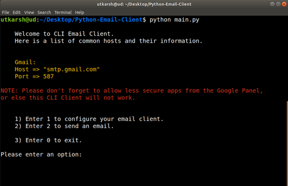

# Email Client CLI

### Overview
Email Client CLI, is a CLI client for sending emails to desired addresses without opening the browser everytime. It requires some packages.
### Demo

Step 1:
We open the CLI envrionment.  

Step 2:
We configure the email information.  

Step 3:
We enter the details and create a sample email message with html and send an email to our desired address.  

Step 4:
We see that the email arrives in the mailbox.  

Step 5:
We can now see the whole formatted email.  

### Requirements
- Python Version 3.4 or above
- Pip Version 9.0 or above
- Package Termcolor. ``pip3 install termcolor --user``
- A cup of coffee near you.

### Installation
You should have MIME and SMTP libraries pre-installed which are default in Python version 3.4 and above.
You should also have Termcolor package installed which you can do with the following command.
``pip3 install termcolor --user``

- After that just download this package and extract the zip file.
- After extracting the package, run the main.py file with the following command.
``python main.py ``
- Sip your coffee now.

### Contributions
Hey if you are interested in contributing in this open-source project. Please open a pull request or an issue to improve the current state of this project.

If you have better versions of this project, then contact me and we can get the ball rolling.

[Visit my website](http://utkarsh.co)
